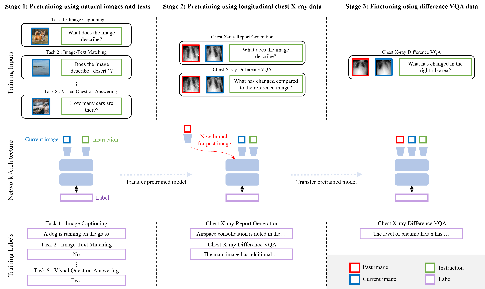

# PLURAL
This repository is the implementation of [Pretraining Vision-Language Model for Difference Visual Question Answering in Longitudinal Chest X-ray](https://arxiv.org/abs/2402.08966)

# Overview
Difference visual question answering (diff-VQA) is a challenging task that requires answering complex questions based on differences between a pair of images. This task is particularly important in reading chest X-ray images because radiologists often compare multiple images of the same patient taken at different times to track disease progression and changes in its severity in their clinical practice. However, previous works focused on designing specific network architectures for the diff-VQA task, missing opportunities to enhance the model's performance using a pretrained vision-language model (VLM). Here, we introduce a novel VLM called PLURAL, which is pretrained on natural and longitudinal chest X-ray data for the diff-VQA task. The model is developed using a step-by-step approach, starting with being pretrained on natural images and texts, followed by being trained using longitudinal chest X-ray data. The longitudinal data consist of pairs of X-ray images, along with question-answer sets and radiologist's reports that describe the changes in lung abnormalities and diseases over time. Our experimental results show that the PLURAL model outperforms state-of-the-art methods not only in diff-VQA for longitudinal X-rays but also in conventional VQA for a single X-ray image. Through extensive experiments, we demonstrate the effectiveness of the proposed VLM architecture and pretraining method in improving the model's performance.



# Environment


```python
conda create -n plural python=3.7
conda activate plural
conda install pytorch==1.13.1 torchvision==0.14.1 torchaudio==0.13.1 pytorch-cuda=11.7 -c pytorch -c nvidia
pip install -r requirements.txt
cd PLURAL/fairseq/
pip install ./
cd ../
sed '1d' requirements.txt | xargs -I {} pip install {}
```
# Data Preparation and Preprocessing
We use the two datasets: [MIMIC-CXR](https://physionet.org/content/mimic-cxr-jpg/2.0.0/) and [MIMIC-Diff-VQA](https://physionet.org/content/medical-diff-vqa/1.0.0/)
- For extracting Findings and Impression sections of report, we use the code of  [R2Gen](https://github.com/cuhksz-nlp/R2Gen) and [CXR-RePaiR](https://github.com/rajpurkarlab/CXR-RePaiR)
- For preprocessing, we use code of the [R2Gen](https://github.com/cuhksz-nlp/R2Gen)


# Checkpoints
- [PLURAL.pt](https://drive.google.com/file/d/1VeGH9f9zfwD35aLWf7T7bqMzX3gsrY84/view?usp=sharing)


# Train
1. Pretrain
```python
. run_scripts/caption/train1_pretrain.sh
```
2. Finetune
```python
. run_scripts/caption/train2_finetune.sh
```


# Test & Inference
```python
python test_eval.py
```

# Related Codebase
- [Fairseq](https://github.com/facebookresearch/fairseq)
- [OFA](https://github.com/OFA-Sys/OFA?tab=readme-ov-file)
- [pycocoevalcap](https://github.com/salaniz/pycocoevalcap)